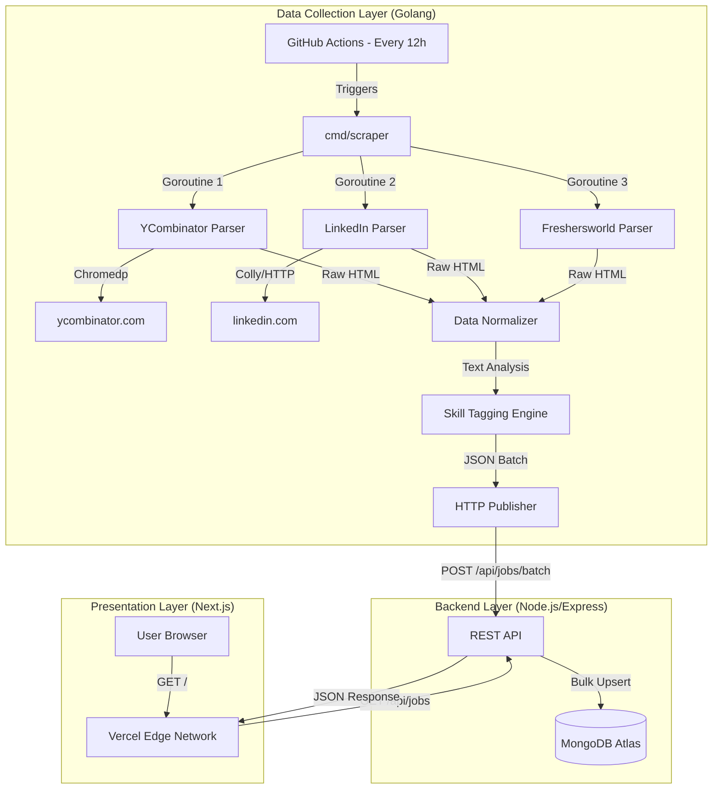

# 🕷️ ScrapHire - The Intelligent Job Aggregator

**ScrapHire** is a robust, full-stack job aggregation platform designed to automatically discover, filter, and index software engineering opportunities from across the web. It serves as a centralized hub for developers to find high-quality job listings from top sources like Y Combinator, LinkedIn, and more, all in a single, modern interface.


---

## 🌐 Live Deployments

| Component | URL | Hosting Provider |
|-----------|-----|------------------|
| **Frontend** | [https://scraphire.vercel.app](https://scraphire.vercel.app) | ▲ Vercel |
| **Backend API** | [https://job-aggregator-1vi4.onrender.com](https://job-aggregator-1vi4.onrender.com) | ☁️ Render |
| **Database** | MongoDB Atlas Cluster | 🍃 MongoDB Cloud |
| **CI/CD** | GitHub Actions | � GitHub |

---

## �🚀 Key Features

### 🤖 Intelligent Automation
- **Scheduled Scraping**: Runs automatically every 12 hours via GitHub Actions CRON jobs.
- **Concurrency**: Uses Go's goroutines to scrape multiple sources simultaneously for maximum speed.
- **Headless Browsing**: Utilizes `chromedp` to render and scrape JavaScript-heavy single-page applications (SPAs) like Y Combinator.

### 🧠 Smart Processing
- **Skill Extraction Engine**: Analyzes job descriptions and titles to automatically tag relevant skills (e.g., "React", "Go", "Docker", "AWS").
- **Noise Filtering**: Automatically discards non-software roles (e.g., "HR Manager", "Sales Exec") to keep the feed clean.
- **Deduplication**: Uses unique composite keys (ID + Source) to ensure the same job is never listed twice.

### ⚡ Modern Experience
- **Instant Search**: Real-time filtering by title, company, or tech stack.
- **Responsive Design**: Mobile-first UI built with Tailwind CSS.
- **Pagination**: Efficiently handles large datasets.

---

## 🏗️ Technical Architecture

ScrapHire is built as a distributed system with a clear separation of concerns.



---

## � Deep Dive: How It Works

### 1. The Scraper Service (`/scrapers`)
Written in **Go (Golang)** for performance and concurrency.

- **Entry Point**: `cmd/scraper/main.go`
    - Initializes the parsing registry.
    - Launches a goroutine for each parser (`waitGroup` pattern).
    - Collects results via a buffered channel.
- **Parsers (`internal/parsers/`)**: 
    - Each site has a dedicated parser implementing the `Parser` interface.
    - **YCombinator Parser**: Uses `chromedp` to spawn a headless Chrome instance. It executes custom JavaScript in the browser context to traverse the DOM and extract job cards that are dynamically rendered.
- **Skill Tokenizer (`internal/skills/matcher.go`)**:
    - Contains a `SkillMap` of 100+ tech keywords.
    - Uses strict logic to distinguish common words from tech skills (e.g., "Go" the language vs "go" the verb).
    - Checks job titles and descriptions against this map to generate an array of tags (e.g., `["Python", "Django", "AWS"]`).

### 2. The Backend API (`/backend`)
Written in **TypeScript** & **Node.js** for type safety and rapid development.

- **Batch Processing**: The scraper sends jobs in batches (e.g., 50 at a time).
- **Idempotency Strategy**:
    - The database uses an `externalId` (e.g., `yc-12345`).
    - The API uses MongoDB's `bulkWrite` operation with `{ upsert: true }`.
    - **Result**: If a job already exists, it updates it (e.g., new tags or active status). If not, it inserts it. Millions of duplicates are prevented.
- **Search Logic**:
    - Uses MongoDB regex queries to perform fuzzy matching on Title and Company fields.

### 3. The Frontend (`/frontend`)
Built with **Next.js 14** (App Router) and **Tailwind CSS**.

- **Server-Side Rendering (SSR)**: Initial HTML is generated on the server for SEO and performance.
- **Client-Side Interactivity**: Search and Pagination use `useEffect` hooks to fetch data dynamically without page reloads.
- **Design System**: Features a custom `JobCard` component with hover effects, tag pills, and relative time formatting (e.g., "2 hours ago").

---

## 🛠️ Tech Stack & Dependencies

### Backend
- **Runtime**: Node.js v18+
- **Framework**: Express.js
- **Database**: MongoDB (Mongoose ODM)
- **Language**: TypeScript
- **Security**: Helmet, CORS

### Frontend
- **Framework**: Next.js 14
- **Language**: TypeScript
- **Styling**: Tailwind CSS, Lucide React (Icons)
- **HTTP Client**: Axios

### Scraper
- **Language**: Go 1.25
- **Browser Automation**: Chromedp (Chrome DevTools Protocol)
- **HTML Parsing**: GoQuery
- **Scheduling**: GitHub Actions

---

## 📂 Repository Structure

```pbtxt
job-aggregator/
├── .github/workflows/    # CI/CD Automation
│   └── scraper.yml       # Cron job definition
├── backend/              # Node.js API Service
│   ├── src/
│   │   ├── controllers/  # Request handlers
│   │   ├── models/       # Database schemas
│   │   └── routes/       # API endpoints
│   ├── package.json
│   └── tsconfig.json
├── frontend/             # Next.js Web App
│   ├── src/
│   │   ├── app/          # Next.js App Router pages
│   │   ├── components/   # Reusable UI components
│   │   └── lib/          # Utilities
│   └── package.json
├── scrapers/             # Go Scraping Service
│   ├── cmd/scraper/      # Main entry point
│   ├── internal/
│   │   ├── parsers/      # Site-specific scraping logic
│   │   ├── publisher/    # Network layer
│   │   └── skills/       # Text analysis logic
│   └── go.mod
└── infra/                # Local Development Infrastructure
    └── docker-compose.yml
```

---

## 🏃‍♂️ Running Locally

Follow these steps to spin up the entire system on your machine.

### Prerequisites
- Docker & Docker Compose
- Node.js & npm
- Go installed

### 1. Start Database
Use Docker to spin up a local MongoDB instance.
```bash
cd infra
docker-compose up -d
```
*This starts MongoDB on `localhost:27017`.*

### 2. Start Backend
```bash
cd backend
cp .env.example .env  # (Or create .env with MONGO_URI=mongodb://localhost:27017/job-aggregator)
npm install
npm run dev
```
*Server runs on `http://localhost:5000`.*

### 3. Start Frontend
```bash
cd frontend
# Create .env.local if you want to point to local backend
echo "NEXT_PUBLIC_API_URL=http://localhost:5000/api" > .env.local
npm install
npm run dev
```
*App runs on `http://localhost:3000`.*

### 4. Run Scraper
To populate your local database with real jobs:
```bash
cd scrapers
# Set local backend URL
export BACKEND_API_URL=http://localhost:5000/api/jobs/batch
go run cmd/scraper/main.go
```

---

## 📡 API Documentation

### Base URL
`https://job-aggregator-1vi4.onrender.com`

### Endpoints

#### 1. Get Jobs
Fetch a paginated list of jobs with optional filters.

- **URL**: `GET /api/jobs`
- **Query Params**:
  - `page` (number): Page number (default: 1)
  - `limit` (number): Jobs per page (default: 20)
  - `search` (string): Search term for title/company
  - `tag` (string): Filter by specific skill (e.g., "Python")

**Response**:
```json
{
  "jobs": [
    {
      "_id": "670...",
      "title": "Senior Software Engineer",
      "company": "Y Combinator Startup",
      "tags": ["React", "Node.js"],
      "remote": true,
      "postedAt": "2024-03-20T10:00:00.000Z"
    }
  ],
  "total": 150,
  "currentPage": 1,
  "totalPages": 8
}
```

#### 2. Batch Create (Internal)
Used by the scraper to push data.

- **URL**: `POST /api/jobs/batch`
- **Body**: Array of Job objects.

---

## 📝 License
This project is open-source and available under the [MIT License](LICENSE).
